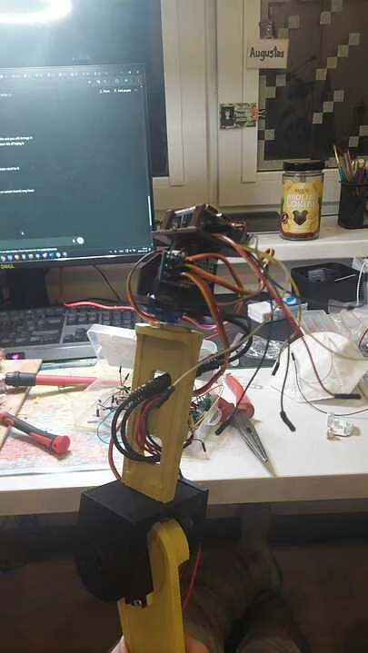
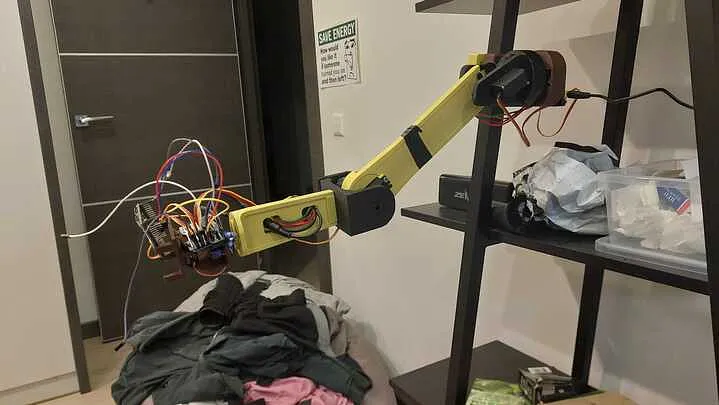
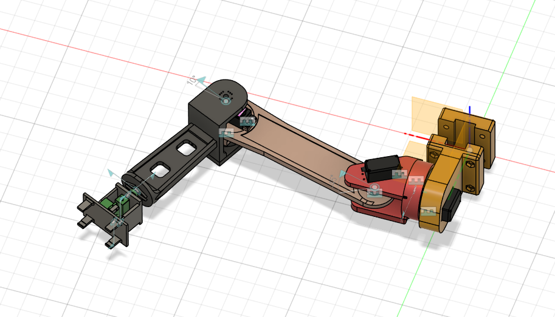
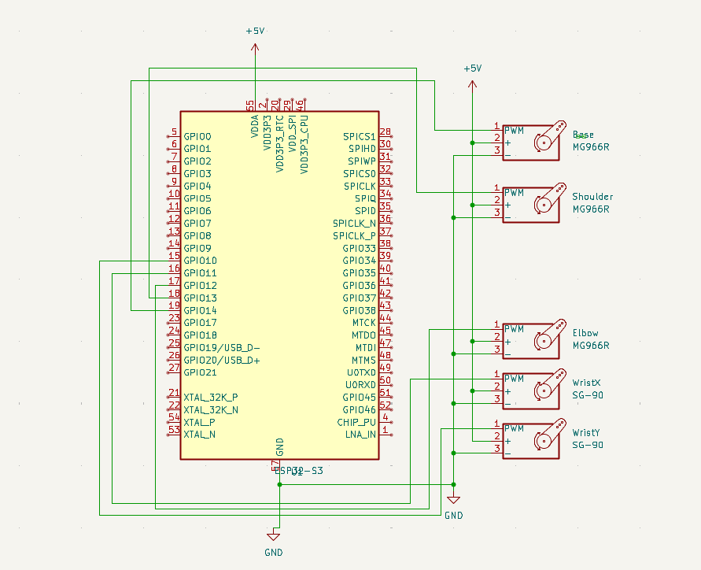
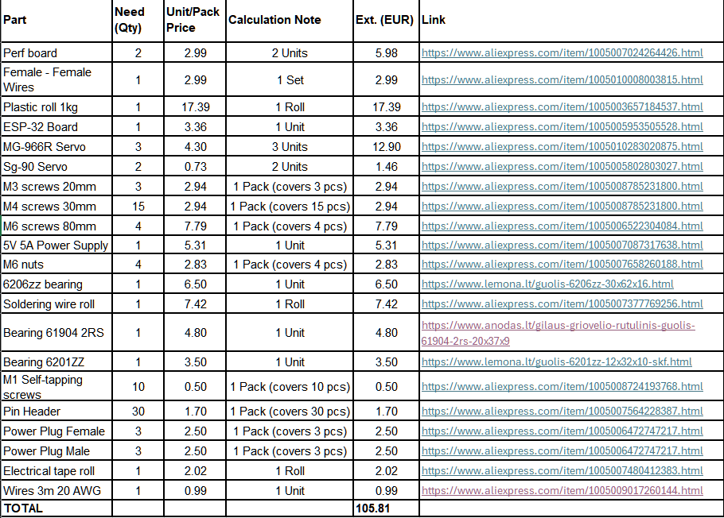

# Robot-Arm
# Description
Pretty basic robotic 5 axis robotic arm, containing these axis: base, shoulder, elboew, wristx, wristy. To recreate this project, you can 3d print it, assemble it and upload provided firmware.

# Why
My main goal building such device, was deepen my knowledge of robotics, improve my electrical and mechanical fields. As well it is pretty cool project in general.

# Notes 
- Altough my main idea was to add camera to it, it turned out to be way more complicated, so I dumped that idea.
- If you want smoother movement of arm, I don't recommend buying cheapest knock-off motors and instead investing a bit more money into this. As I described in my journal, motors I bought were falsly advertised, so robot was failing :/.
- I recommend using different power supplys for Esp and motors, due to stability issues.
- Blue parts in Model\Asembly.step showcase where perf boards and esp is mounted.
- Perf boards serve as place for pin heads to be soldered on, so entire assmebly would be easier to take appart and maintain, without constant resoldering.

# Gallery

# Wiring

# BOM

